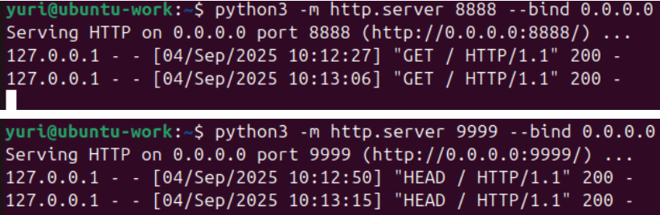
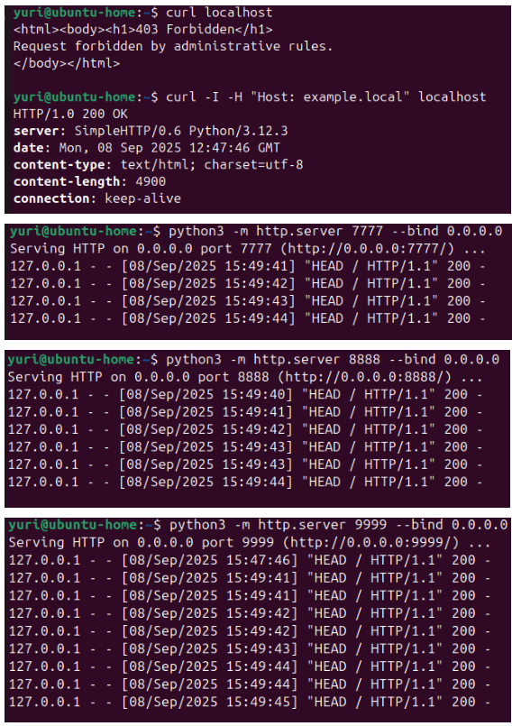
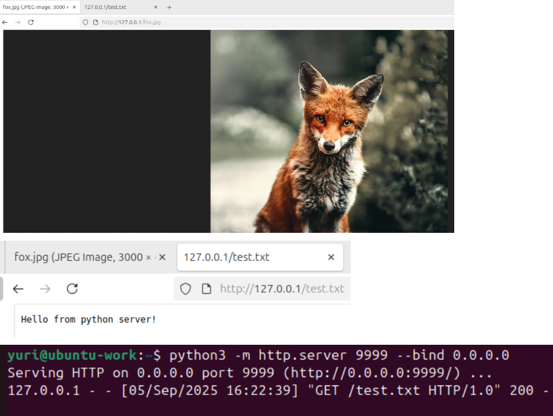
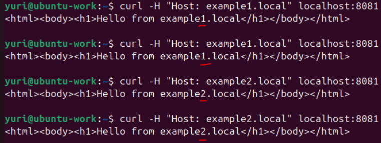

# «Кластеризация и балансировка нагрузки»

### Цель задания
В результате выполнения этого задания вы научитесь:
1. Настраивать балансировку с помощью HAProxy
2. Настраивать связку HAProxy + Nginx

------

### Задание 1
- Запустите два simple python сервера на своей виртуальной машине на разных портах
- Установите и настройте HAProxy, воспользуйтесь материалами к лекции 
- Настройте балансировку Round-robin на 4 уровне.
- На проверку направьте конфигурационный файл haproxy, скриншоты, где видно перенаправление запросов на разные серверы при обращении к HAProxy.

#### start python servers:
```
python3 -m http.server 8888 --bind 0.0.0.0
python3 -m http.server 9999 --bind 0.0.0.0
```

#### loadbalancer config:


#### check loadbalancer:
```
curl -I localhost:8080
```



### Задание 2
- Запустите три simple python сервера на своей виртуальной машине на разных портах
- Настройте балансировку Weighted Round Robin на 7 уровне, чтобы первый сервер имел вес 2, второй - 3, а третий - 4
- HAproxy должен балансировать только тот http-трафик, который адресован домену example.local
- На проверку направьте конфигурационный файл haproxy, скриншоты, где видно перенаправление запросов на разные серверы при обращении к HAProxy c использованием домена example.local и без него.

#### loadbalancer config:
```
frontend tcp
        mode tcp
        option tcplog
        bind *:8080
        default_backend pythons_servers_tcp

frontend http
        mode http
        bind *:80
        acl ACL_example.local hdr(host) -i example.local
        use_backend example.local if ACL_example.local

backend example.local
        mode http
        balance roundrobin
        server s1 0.0.0.0:7777 check weight 2
        server s2 0.0.0.0:8888 check weight 3
        server s3 0.0.0.0:9999 check weight 4

backend pythons_servers_tcp
        mode tcp
        balance roundrobin
        server s1 0.0.0.0:8888
        server s2 0.0.0.0:9999
```

#### check loadbalancer:
```
curl -I -H "Host: example.local" localhost
```



---

### Задание 3*
- Настройте связку HAProxy + Nginx как было показано на лекции.
- Настройте Nginx так, чтобы файлы .jpg выдавались самим Nginx (предварительно разместите несколько тестовых картинок в директории /var/www/), а остальные запросы переадресовывались на HAProxy, который в свою очередь переадресовывал их на два Simple Python server.
- На проверку направьте конфигурационные файлы nginx, HAProxy, скриншоты с запросами jpg картинок и других файлов на Simple Python Server, демонстрирующие корректную настройку.

#### nginx config:
```
server {
        listen 80 default_server;
        listen [::]:80 default_server;
        root /var/www/html;
        index index.html index.htm index.nginx-debian.html;

        server_name _;

        location ~ \.(jpg)$ {
                root /var/www/html/pictures;
        }

        location / {
                proxy_pass http://127.0.0.1:8081/;
        }
}
```

#### HAproxy config:
```
frontend tcp
        mode tcp
        option tcplog
        bind *:8080
        default_backend pythons_servers_tcp

frontend http
        mode http
        bind *:8081
        use_backend pythons_servers_http

backend pythons_servers_http
        mode http
        balance roundrobin
        server s1 0.0.0.0:8888 check weight 2
        server s2 0.0.0.0:9999 check weight 1

backend pythons_servers_tcp
        mode tcp
        balance roundrobin
        server s1 0.0.0.0:8888
        server s2 0.0.0.0:9999
```



---

### Задание 4*
- Запустите 4 simple python сервера на разных портах.
- Первые два сервера будут выдавать страницу index.html вашего сайта example1.local (в файле index.html напишите example1.local)
- Вторые два сервера будут выдавать страницу index.html вашего сайта example2.local (в файле index.html напишите example2.local)
- Настройте два бэкенда HAProxy
- Настройте фронтенд HAProxy так, чтобы в зависимости от запрашиваемого сайта example1.local или example2.local запросы перенаправлялись на разные бэкенды HAProxy
- На проверку направьте конфигурационный файл HAProxy, скриншоты, демонстрирующие запросы к разным фронтендам и ответам от разных бэкендов.

#### HAproxy config:
```
frontend http
        mode http
        bind *:8081
        acl ACL_example1.local hdr(host) -i example1.local
        acl ACL_example2.local hdr(host) -i example2.local
        use_backend back1 if ACL_example1.local
        use_backend back2 if ACL_example2.local

backend back1
        mode http
        balance roundrobin
        server s1 0.0.0.0:6666 check
        server s2 0.0.0.0:7777 check

backend back2
        mode http
        balance roundrobin
        server s1 0.0.0.0:8888 check
        server s2 0.0.0.0:9999 check
```



------

## Result in Google Docs :white_check_mark:

[Nginx + HAproxy](https://docs.google.com/document/d/10h1YnYZCFbrbbmmhxDm4eqiOHmPC_YQ9dvt_H16to14/edit?usp=sharing)