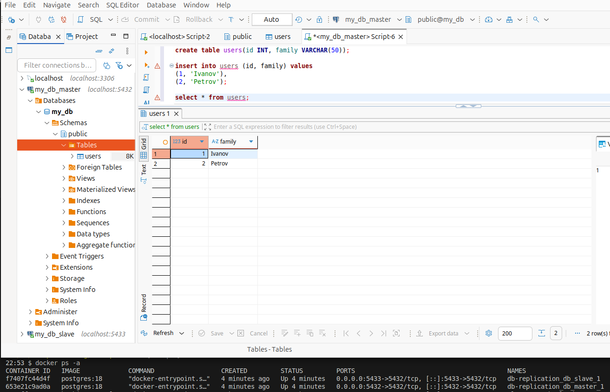

### Задание 1

Репликации master-slave, master-master, опишите их различия.

Master:
- работает на чтение и запись
- принимает и обрабатывает запросы (INSERTE/UPDATE/DELETE)
- передает изменения на slave

Slave:
- работает только на чтение
- принимает изменения от master

Master–Slave  - один главный сервер, остальные подчиненые. Запись возможно только на одном сервере.
Master–Master - запись и чтение возможны на двух серверах, они равноправны.

---

### Задание 2

Выполните конфигурацию master-slave репликации.

Все конфигурации в репозитории.

