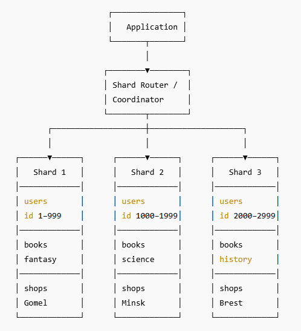
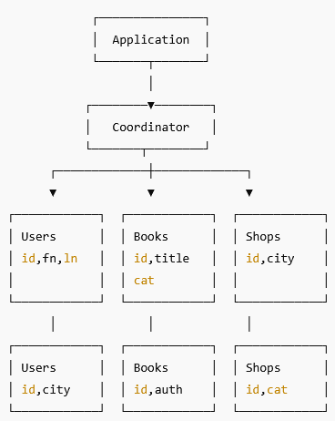

### Задание 1

Опишите основные преимущества использования масштабирования методами:

- активный master-сервер и пассивный репликационный slave-сервер:
1) выше отказоустойчивость
2) простота реализации и администрирования
3) резервная копия базы
4) отсутствие конфликтов

- master-сервер и несколько slave-серверов;
1) отказоустойчивость еще выше
2) сложнее реализация и администрирование 
3) резервная копия базы
4) распределение запросов на чтение между slave, тем самым снимая нагрузку с master

---

### Задание 2

Разработайте план для выполнения горизонтального и вертикального шаринга базы данных. База данных состоит из трёх таблиц: 

- пользователи, 
- книги, 
- магазины (столбцы произвольно). 

Опишите принципы построения системы и их разграничение или разбивку между базами данных.

*Пришлите блоксхему, где и что будет располагаться. Опишите, в каких режимах будут работать сервера.* 

1) **Горизонтальный шардинг** - деление таблицы по строкам.
База данных состоит из трёх таблиц:

**пользователи:**
users(id, firstname, lastname, city)

выбираем ключ распределения - например id.

**книги:**
books(id, title, author, category)

выбираем ключ распределения - category.

**магазины:**
shops(id, city, category)

выбираем ключ распределения - city.

Создаем три шарда, каждый шард содержит три таблицы, но данные в каждой из таблиц в шарде распределены по своему ключу.

**Таблица пользователи:**

Первый шард: id 1 - 999

Второй шард: id 1000 - 1999

Третий шард: id 2000 - 2999

**Таблица книги:**

Первый шард: category - fantasy

Второй шард: category - science

Третий шард: category - history

**Таблица магазины:**

Первый шард: city - Gomel

Второй шард: city - Minsk

Третий шард: city - Brest

*для лучшей производительности таблицы в шардах можно объеденять по общим ключам.

Можно использовать один  master-сервер (для чтения и записи) и один slave-сервер(для чтения) на каждый шард.

Итого 6 серверов в минимальной отказоустойчивой конфигурации.

2) **Вертикальный шардинг** - деление таблицы по столбцам.

**Таблица пользователи:**

Первый шард: id, firstname, lastname

Второй шард: id, city

**Таблица книги:**

Первый шард: id, title, category

Второй шард: id, author

**Таблица магазины:**

Первый шард: id, city

Второй шард: id, category

Можно использовать один  master-сервер (для чтения и записи) и один slave-сервер(для чтения) на каждый шард.

Итого 4 сервера в минимальной отказоустойчивой конфигурации.

## Дополнительные задания (со звёздочкой*)
Эти задания дополнительные, то есть не обязательные к выполнению, и никак не повлияют на получение вами зачёта по этому домашнему заданию. Вы можете их выполнить, если хотите глубже шире разобраться в материале.

---
### Задание 3*

Выполните настройку выбранных методов шардинга из задания 2.

*Пришлите конфиг Docker и SQL скрипт с командами для базы данных*.

Шардирование выполнено на примере таблицы Users.

