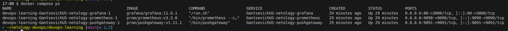
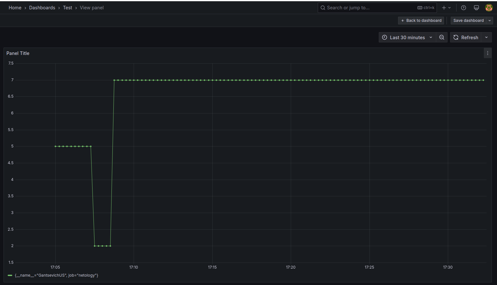
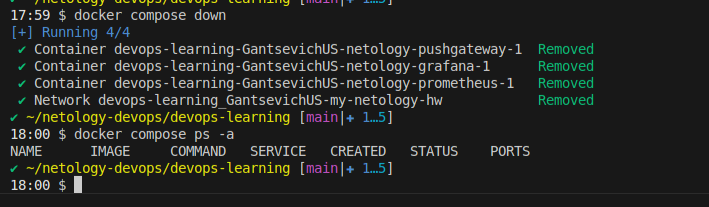

# Домашнее задание к занятию "`Docker. Часть 2`" - `Ганцевич Юрий Сергеевич`


### Инструкция по выполнению домашнего задания

   1. Сделайте `fork` данного репозитория к себе в Github и переименуйте его по названию или номеру занятия, например, https://github.com/имя-вашего-репозитория/git-hw или  https://github.com/имя-вашего-репозитория/7-1-ansible-hw).
   2. Выполните клонирование данного репозитория к себе на ПК с помощью команды `git clone`.
   3. Выполните домашнее задание и заполните у себя локально этот файл README.md:
      - впишите вверху название занятия и вашу фамилию и имя
      - в каждом задании добавьте решение в требуемом виде (текст/код/скриншоты/ссылка)
      - для корректного добавления скриншотов воспользуйтесь [инструкцией "Как вставить скриншот в шаблон с решением](https://github.com/netology-code/sys-pattern-homework/blob/main/screen-instruction.md)
      - при оформлении используйте возможности языка разметки md (коротко об этом можно посмотреть в [инструкции  по MarkDown](https://github.com/netology-code/sys-pattern-homework/blob/main/md-instruction.md))
   4. После завершения работы над домашним заданием сделайте коммит (`git commit -m "comment"`) и отправьте его на Github (`git push origin`);
   5. Для проверки домашнего задания преподавателем в личном кабинете прикрепите и отправьте ссылку на решение в виде md-файла в вашем Github.
   6. Любые вопросы по выполнению заданий спрашивайте в чате учебной группы и/или в разделе “Вопросы по заданию” в личном кабинете.
   
Желаем успехов в выполнении домашнего задания!
   
### Дополнительные материалы, которые могут быть полезны для выполнения задания

1. [Руководство по оформлению Markdown файлов](https://gist.github.com/Jekins/2bf2d0638163f1294637#Code)

---

### Задание 1
Напишите ответ в свободной форме, не больше одного абзаца текста.
Установите Docker Compose и опишите, для чего он нужен и как может улучшить лично вашу жизнь.

`Docker Compose необходим для запуска/выключения/отладки многих сервисов из одной точки: compose файла формата yaml.
Сильно упрощает задачу поддержания работоспособности микросервисного приложения.`

```
sudo apt-get update
sudo apt-get install docker-compose-plugin
docker compose version
```

---

### Задание 2

Выполните действия и приложите текст конфига на этом этапе.

Создайте файл docker-compose.yml и внесите туда первичные настройки:

version;
services;
volumes;
networks.
При выполнении задания используйте подсеть 10.5.0.0/16. Ваша подсеть должна называться: <ваши фамилия и инициалы>-my-netology-hw. Все приложения из последующих заданий должны находиться в этой конфигурации.

```
version: "3.9"
services:
  GantsevichUS-netology-prometheus:
	# To Do
  GantsevichUS-netology-pushgateway:
	# To Do
  GantsevichUS-netology-grafana:
	# To Do


networks:
  GantsevichUS-my-netology-hw:
    driver: bridge
    ipam:
      config:
        - subnet: "10.5.0.0/16"

volumes:
   prometheus-data:
   grafana-data:
```

---

### Задание 3

Выполните действия:

Создайте конфигурацию docker-compose для Prometheus с именем контейнера <ваши фамилия и инициалы>-netology-prometheus.
Добавьте необходимые тома с данными и конфигурацией (конфигурация лежит в репозитории в директории 6-04/prometheus ).
Обеспечьте внешний доступ к порту 9090 c докер-сервера.

```
services:
  GantsevichUS-netology-prometheus:
    image: prom/prometheus:v3.3.0
    volumes: 
      - ./prometheus:/etc/prometheus/
      -  prometheus-data:/prometheus
    networks:
      - GantsevichUS-my-netology-hw
    ports:
      - 9090:9090
```

---

### Задание 4

Выполните действия:

Создайте конфигурацию docker-compose для Pushgateway с именем контейнера <ваши фамилия и инициалы>-netology-pushgateway.
Обеспечьте внешний доступ к порту 9091 c докер-сервера.

```
GantsevichUS-netology-pushgateway:
    image: prom/pushgateway:v1.11.1
    networks:
      - GantsevichUS-my-netology-hw
    ports:
    - 9091:9091
```

---

### Задание 5

Выполните действия:

Создайте конфигурацию docker-compose для Grafana с именем контейнера <ваши фамилия и инициалы>-netology-grafana.
Добавьте необходимые тома с данными и конфигурацией (конфигурация лежит в репозитории в директории 6-04/grafana.
Добавьте переменную окружения с путем до файла с кастомными настройками (должен быть в томе), в самом файле пропишите логин=<ваши фамилия и инициалы> пароль=netology.
Обеспечьте внешний доступ к порту 3000 c порта 80 докер-сервера.

```
GantsevichUS-netology-grafana:
    image: grafana/grafana:11.6.1
    volumes:
      - ./grafana/:/etc/grafana/
      - grafana-data:/grafana
    environment:
      - GF_PATHS_CONFIG=/etc/grafana/custom.ini
    networks:
      - GantsevichUS-my-netology-hw
    ports:
      - 80:3000
```

---

### Задание 6
Выполните действия.

Настройте поочередность запуска контейнеров.
Настройте режимы перезапуска для контейнеров.
Настройте использование контейнерами одной сети.
Запустите сценарий в detached режиме.

```
services:
  GantsevichUS-netology-prometheus:
    restart: unless-stopped
  GantsevichUS-netology-pushgateway:
    depends_on:
      - GantsevichUS-netology-prometheus
    restart: unless-stopped
  GantsevichUS-netology-grafana:
    depends_on:
      - GantsevichUS-netology-prometheus
    restart: unless-stopped

docker compose up -d
```
---

### Задание 7

Выполните действия.

Выполните запрос в Pushgateway для помещения метрики <ваши фамилия и инициалы> со значением 5 в Prometheus: echo "<ваши фамилия и инициалы> 5" | curl --data-binary @- http://localhost:9091/metrics/job/netology.
Залогиньтесь в Grafana с помощью логина и пароля из предыдущего задания.
Cоздайте Data Source Prometheus (Home -> Connections -> Data sources -> Add data source -> Prometheus -> указать "Prometheus server URL = http://prometheus:9090" -> Save & Test).
Создайте график на основе добавленной в пункте 5 метрики (Build a dashboard -> Add visualization -> Prometheus -> Select metric -> Metric explorer -> <ваши фамилия и инициалы -> Apply.
В качестве решения приложите:

docker-compose.yml целиком;
скриншот команды docker ps после запуске docker-compose.yml;
скриншот графика, постоенного на основе вашей метрики.

```
services:
  GantsevichUS-netology-prometheus:
    image: prom/prometheus:v3.3.0
    volumes: 
      - ./prometheus:/etc/prometheus/
      -  prometheus-data:/prometheus
    networks:
      - GantsevichUS-my-netology-hw
    ports:
      - 9090:9090
    restart: unless-stopped
  GantsevichUS-netology-pushgateway:
    image: prom/pushgateway:v1.11.1
    networks:
      - GantsevichUS-my-netology-hw
    ports:
    - 9091:9091
    depends_on:
      - GantsevichUS-netology-prometheus
    restart: unless-stopped
  GantsevichUS-netology-grafana:
    image: grafana/grafana:11.6.1
    volumes:
      - ./grafana/:/etc/grafana/
      - grafana-data:/grafana
    environment:
      - GF_PATHS_CONFIG=/etc/grafana/custom.ini
    networks:
      - GantsevichUS-my-netology-hw
    ports:
      - 80:3000
    depends_on:
      - GantsevichUS-netology-prometheus
    restart: unless-stopped


networks:
  GantsevichUS-my-netology-hw:
    driver: bridge
    ipam:
      config:
        - subnet: "10.5.0.0/16"

volumes:
   prometheus-data:
   grafana-data:
```




---

### Задание 8
Выполните действия:

Остановите и удалите все контейнеры одной командой.
В качестве решения приложите скриншот консоли с проделанными действиями.

