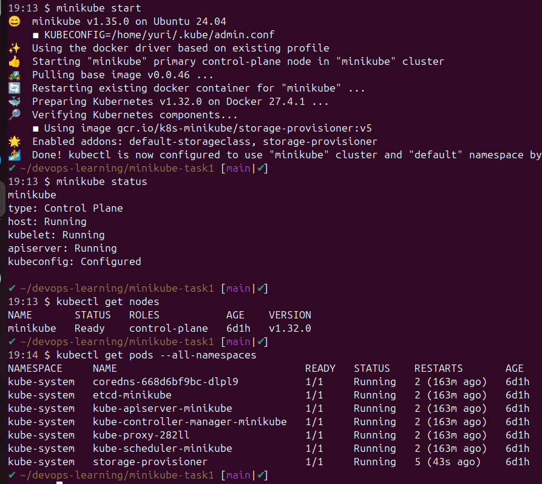
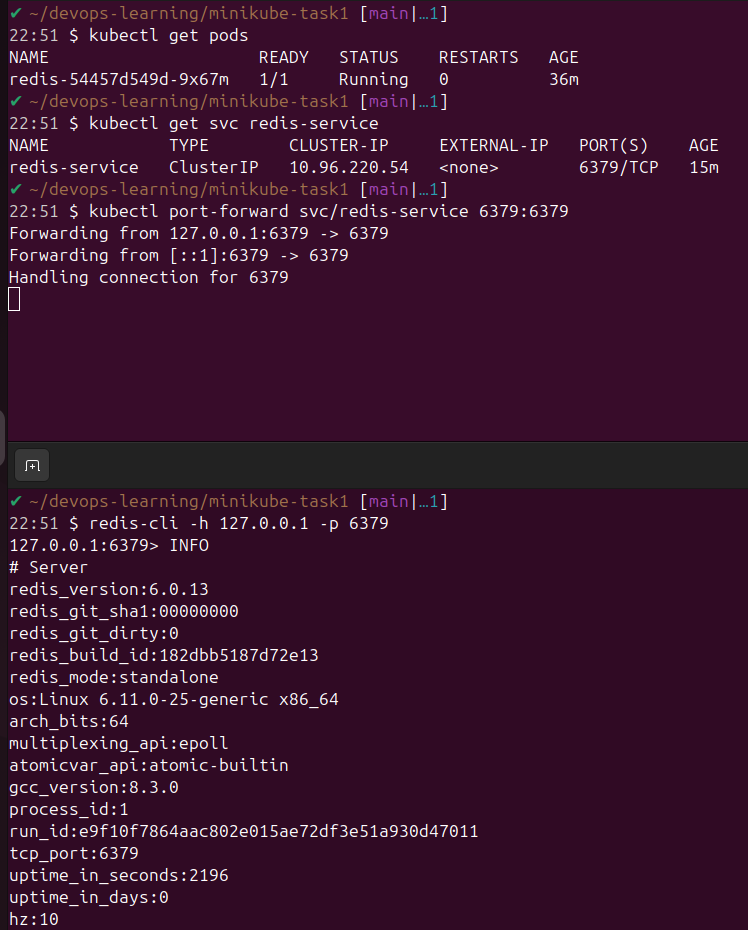
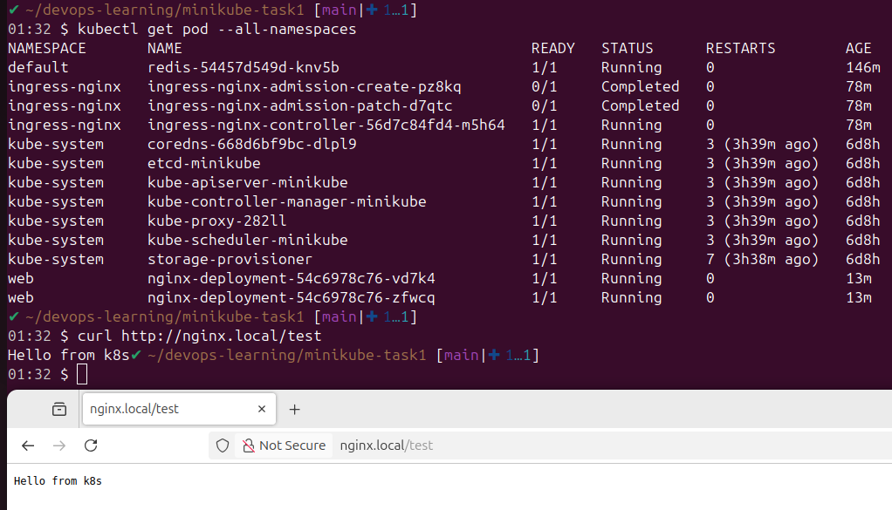

# Домашнее задание к занятию «Kubernetes. Часть 1»

Это задание для самостоятельной отработки навыков и не предполагает обратной связи от преподавателя. Его выполнение не влияет на завершение модуля. Но мы рекомендуем его выполнить, чтобы закрепить полученные знания.

### Задание 1

**Выполните действия:**

1. Запустите Kubernetes локально, используя k3s или minikube на свой выбор.
1. Добейтесь стабильной работы всех системных контейнеров.


### Задание 2

Есть файл с деплоем:

```
apiVersion: apps/v1
kind: Deployment
metadata:
  name: redis
spec:
  selector:
    matchLabels:
      app: redis
  replicas: 1
  template:
    metadata:
      labels:
        app: redis
    spec:
      containers:
      - name: master
        image: bitnami/redis
        env:
         - name: REDIS_PASSWORD
           value: password123
        ports:
        - containerPort: 6379
```


**Выполните действия:**

1. Измените файл с учётом условий:

 * redis должен запускаться без пароля;
 * создайте Service, который будет направлять трафик на этот Deployment;
 * версия образа redis должна быть зафиксирована на 6.0.13.

```
apiVersion: apps/v1
kind: Deployment
metadata:
  name: redis
  labels:
    app: redis
spec:
  replicas: 1
  selector:
    matchLabels:
      app: redis
  template:
    metadata:
      labels:
        app: redis
    spec:
      containers:
        - name: master
          image: bitnami/redis:6.0.13
          env:
            - name: ALLOW_EMPTY_PASSWORD
              value: "yes"
          ports:
            - containerPort: 6379
---
apiVersion: v1
kind: Service
metadata:
  name: redis-service
spec:
  selector:
    app: redis
  ports:
    - port: 6379
      targetPort: 6379
  type: ClusterIP
```

2. Запустите Deployment в своём кластере и добейтесь его стабильной работы.


### Задание 3

**Выполните действия:**

1. Напишите команды kubectl для контейнера из предыдущего задания:

 - выполнения команды ps aux внутри контейнера;
 - просмотра логов контейнера за последние 5 минут;
 - удаления контейнера;
 - проброса порта локальной машины в контейнер для отладки.

 ```
kubectl exec -it redis-54457d549d-9x67m -- ps aux
kubectl logs redis-54457d549d-9x67m --since=5m
kubectl delete pod redis-54457d549d-9x67m
kubectl port-forward svc/redis-service 6379:6379
 ```

### Задание 4

Есть конфигурация nginx:

```
location / {
    add_header Content-Type text/plain;
    return 200 'Hello from k8s';
}
```

**Выполните действия:**

Напишите yaml-файлы для развёртки nginx, в которых будут присутствовать:

 - ConfigMap с конфигом nginx;
 - Deployment, который бы подключал этот configmap;
 - Ingress, который будет направлять запросы по префиксу /test на наш сервис.

 ```
 apiVersion: v1
kind: Namespace
metadata:
  name: web
---
apiVersion: apps/v1
kind: Deployment
metadata:
  name: nginx-deployment
  namespace: web
  labels:
    app: nginx
spec:
  selector:
    matchLabels:
      app: nginx
  replicas: 2
  template:
    metadata:
      labels:
        app: nginx
    spec:
      containers:
        - name: master
          image: nginx:1.27-alpine
          ports:
            - containerPort: 80
          volumeMounts:
          - name: nginx-config-volume
            mountPath: /etc/nginx/nginx.conf
            subPath: nginx.conf
      volumes:
        - name: nginx-config-volume
          configMap:
            name: nginx-config
---
apiVersion: v1
kind: Service
metadata:
  name: nginx-service
  namespace: web
spec:
  selector:
    app: nginx
  ports:
    - port: 80
      targetPort: 80
  type: ClusterIP
---
apiVersion: networking.k8s.io/v1
kind: Ingress
metadata:
  name: nginx-ingress
  namespace: web
spec:
  ingressClassName: nginx
  rules:
  - host: nginx.local
    http:
      paths:
      - path: /test
        pathType: Prefix
        backend:
          service:
            name: nginx-service
            port:
              number: 80
---
apiVersion: v1
kind: ConfigMap
metadata:
  name: nginx-config
  namespace: web
data:
  nginx.conf: |
    events {}
    http {
      server {
        listen 80;
        location / {
          add_header Content-Type text/plain;
          return 200 'Hello from k8s';
        }
      }
    }

 ```
 