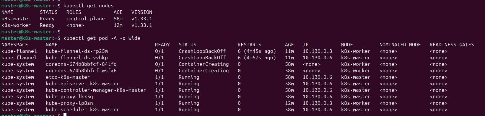

# Домашнее задание к занятию «Kubernetes. Часть 2»

Это задание для самостоятельной отработки навыков и не предполагает обратной связи от преподавателя. Его выполнение не влияет на завершение модуля. Но мы рекомендуем его выполнить, чтобы закрепить полученные знания.

### Задание 1

**Выполните действия:**

1. Создайте свой кластер с помощью kubeadm.
1. Установите любой понравившийся CNI плагин.
1. Добейтесь стабильной работы кластера.

```
# Install docker

# Add Docker's official GPG key:
sudo apt-get update
sudo apt-get install ca-certificates curl
sudo install -m 0755 -d /etc/apt/keyrings
sudo curl -fsSL https://download.docker.com/linux/ubuntu/gpg -o /etc/apt/keyrings/docker.asc
sudo chmod a+r /etc/apt/keyrings/docker.asc

# Add the repository to Apt sources:
echo \
  "deb [arch=$(dpkg --print-architecture) signed-by=/etc/apt/keyrings/docker.asc] https://download.docker.com/linux/ubuntu \
  $(. /etc/os-release && echo "${UBUNTU_CODENAME:-$VERSION_CODENAME}") stable" | \
  sudo tee /etc/apt/sources.list.d/docker.list > /dev/null
sudo apt-get update
echo \
  "deb [arch=$(dpkg --print-architecture) signed-by=/etc/apt/keyrings/docker.asc] https://download.docker.com/linux/ubuntu \
  $(. /etc/os-release && echo "${UBUNTU_CODENAME:-$VERSION_CODENAME}") stable" | \
  sudo tee /etc/apt/sources.list.d/docker.list > /dev/null
sudo apt-get update

sudo apt-get install docker-ce docker-ce-cli containerd.io docker-buildx-plugin docker-compose-plugin
```
```
# Install CRI (cri-dockerd)
sudo apt install golang-go
git clone https://github.com/Mirantis/cri-dockerd.git
cd cri-dockerd
go build -o cri-dockerd main.go
sudo install -o root -g root -m 0755 cri-dockerd /usr/local/bin/cri-dockerd
sudo cp packaging/systemd/* /etc/systemd/system/
sudo sed -i -e 's,/usr/bin/cri-dockerd,/usr/local/bin/cri-dockerd,' /etc/systemd/system/cri-docker.service
sudo systemctl daemon-reload
sudo systemctl enable cri-docker.socket
sudo systemctl start cri-docker.socket
sudo systemctl enable cri-docker.service
sudo systemctl start cri-docker.service
```

```
# Add Kubernetes Repo
# apt-transport-https may be a dummy package; if so, you can skip that package
sudo apt-get install -y apt-transport-https ca-certificates curl gpg
# If the directory `/etc/apt/keyrings` does not exist, it should be created before the curl command, read the note below.
# sudo mkdir -p -m 755 /etc/apt/keyrings
curl -fsSL https://pkgs.k8s.io/core:/stable:/v1.33/deb/Release.key | sudo gpg --dearmor -o /etc/apt/keyrings/kubernetes-apt-keyring.gpg
# This overwrites any existing configuration in /etc/apt/sources.list.d/kubernetes.list
echo 'deb [signed-by=/etc/apt/keyrings/kubernetes-apt-keyring.gpg] https://pkgs.k8s.io/core:/stable:/v1.33/deb/ /' | sudo tee /etc/apt/sources.list.d/kubernetes.list
```

```
# Install Kubernetes Components
sudo apt-get update
sudo apt-get install -y kubelet kubeadm kubectl
sudo apt-mark hold kubelet kubeadm kubectl
sudo systemctl enable --now kubelet
```

```
# Run Kubernetes master 
sudo kubeadm init --cri-socket unix:///var/run/cri-dockerd.sock \
--apiserver-advertise-address=master_internal_ip \
--apiserver-cert-extra-sans=master_external_ip
```

```
# To start using your cluster, you need to run the following as a regular user:

mkdir -p $HOME/.kube
sudo cp -i /etc/kubernetes/admin.conf $HOME/.kube/config
sudo chown $(id -u):$(id -g) $HOME/.kube/config

```

```
# Install CNI (Flannel)
kubectl apply -f https://github.com/flannel-io/flannel/releases/latest/download/kube-flannel.yml
```

```
# Forward ip packet
sudo -i
sudo modprobe br_netfilter
echo "net.ipv4.ip_forward=1" >> /etc/sysctl.conf
echo "net.bridge.bridge-nf-call-iptables=1" >> /etc/sysctl.conf
sysctl -p /etc/sysctl.conf
```



### Задание 2

Есть файл с деплоем:

```yaml
---
apiVersion: apps/v1
kind: Deployment
metadata:
  name: redis
spec:
  selector:
    matchLabels:
      app: redis
  replicas: 1
  template:
    metadata:
      labels:
        app: redis
    spec:
      containers:
      - name: master
        image: bitnami/redis
        env:
         - name: REDIS_PASSWORD
           value: password123
        ports:
        - containerPort: 6379
```
**Выполните действия:**

1. Создайте Helm Charts.
1. Добавьте в него сервис.
1. Вынесите все нужные, на ваш взгляд, параметры в `values.yaml`.
1. Запустите чарт в своём кластере и добейтесь его стабильной работы.


### Задание 3*

1. Изучите [документацию](https://kubernetes.io/docs/concepts/storage/volumes/#hostpath) по подключению volume типа hostPath.
1. Дополните деплоймент в чарте подключением этого volume.
1. Запишите что-нибудь в файл на сервере, подключившись к поду с помощью `kubectl exec`, и проверьте правильность подключения volume.

