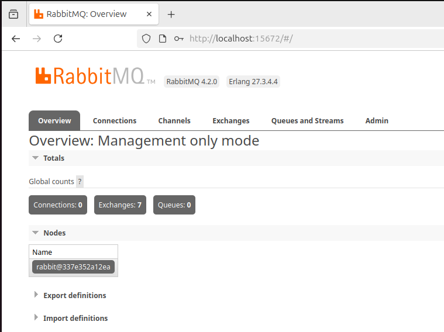
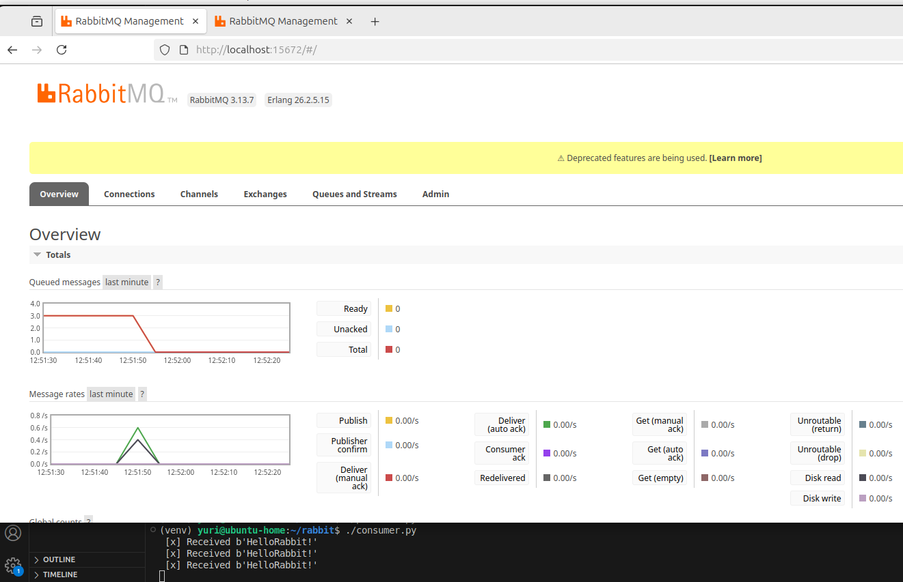
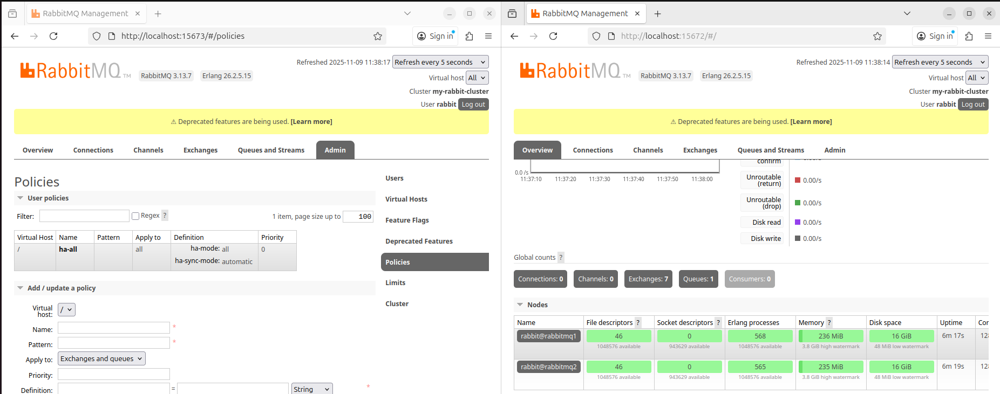
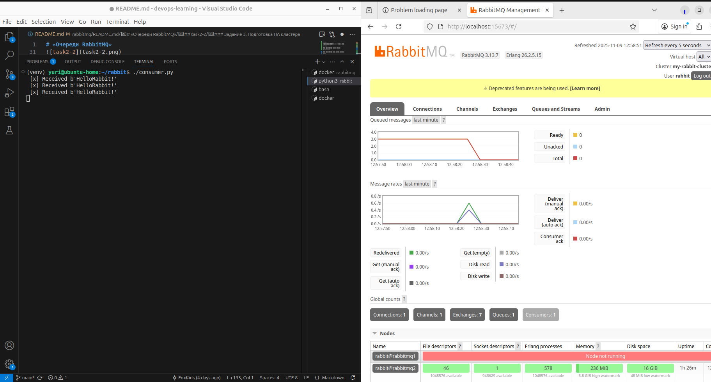

# «Очереди RabbitMQ»


### Задание 1. Установка RabbitMQ

Используя Vagrant или VirtualBox, создайте виртуальную машину и установите RabbitMQ.
Добавьте management plug-in и зайдите в веб-интерфейс.

*Итогом выполнения домашнего задания будет приложенный скриншот веб-интерфейса RabbitMQ.*


---

### Задание 2. Отправка и получение сообщений

Используя приложенные скрипты, проведите тестовую отправку и получение сообщения.
Для отправки сообщений необходимо запустить скрипт producer.py.

Для работы скриптов вам необходимо установить Python версии 3 и библиотеку Pika.
Также в скриптах нужно указать IP-адрес машины, на которой запущен RabbitMQ, заменив localhost на нужный IP.

Зайдите в веб-интерфейс, найдите очередь под названием hello и сделайте скриншот.
После чего запустите второй скрипт consumer.py и сделайте скриншот результата выполнения скрипта

*В качестве решения домашнего задания приложите оба скриншота, сделанных на этапе выполнения.*

Для закрепления материала можете попробовать модифицировать скрипты, чтобы поменять название очереди и отправляемое сообщение.



---

### Задание 3. Подготовка HA кластера

Используя Vagrant или VirtualBox, создайте вторую виртуальную машину и установите RabbitMQ.
Добавьте в файл hosts название и IP-адрес каждой машины, чтобы машины могли видеть друг друга по имени.

Пример содержимого hosts файла:
```shell script
$ cat /etc/hosts
192.168.0.10 rmq01
192.168.0.11 rmq02
```
После этого ваши машины могут пинговаться по имени.

Затем объедините две машины в кластер и создайте политику ha-all на все очереди.

*В качестве решения домашнего задания приложите скриншоты из веб-интерфейса с информацией о доступных нодах в кластере и включённой политикой.*




Также приложите вывод команды с двух нод:

```
root@rabbitmq1:/# rabbitmqctl cluster_status
Cluster status of node rabbit@rabbitmq1 ...
Basics

Cluster name: my-rabbit-cluster
Total CPU cores available cluster-wide: 8

Disk Nodes

rabbit@rabbitmq1
rabbit@rabbitmq2

Running Nodes

rabbit@rabbitmq1
rabbit@rabbitmq2

Versions

rabbit@rabbitmq1: RabbitMQ 3.13.7 on Erlang 26.2.5.15
rabbit@rabbitmq2: RabbitMQ 3.13.7 on Erlang 26.2.5.15

CPU Cores

Node: rabbit@rabbitmq1, available CPU cores: 4
Node: rabbit@rabbitmq2, available CPU cores: 4

Maintenance status

Node: rabbit@rabbitmq1, status: not under maintenance
Node: rabbit@rabbitmq2, status: not under maintenance

Alarms

(none)
```

```
root@rabbitmq2:/# rabbitmqctl cluster_status
Cluster status of node rabbit@rabbitmq2 ...
Basics

Cluster name: my-rabbit-cluster
Total CPU cores available cluster-wide: 8

Disk Nodes

rabbit@rabbitmq1
rabbit@rabbitmq2

Running Nodes

rabbit@rabbitmq1
rabbit@rabbitmq2

Versions

rabbit@rabbitmq2: RabbitMQ 3.13.7 on Erlang 26.2.5.15
rabbit@rabbitmq1: RabbitMQ 3.13.7 on Erlang 26.2.5.15

CPU Cores

Node: rabbit@rabbitmq2, available CPU cores: 4
Node: rabbit@rabbitmq1, available CPU cores: 4

Maintenance status

Node: rabbit@rabbitmq2, status: not under maintenance
Node: rabbit@rabbitmq1, status: not under maintenance

Alarms

(none)
```

После чего попробуйте отключить одну из нод, желательно ту, к которой подключались из скрипта, затем поправьте параметры подключения в скрипте consumer.py на вторую ноду и запустите его.

*Приложите скриншот результата работы второго скрипта.*


