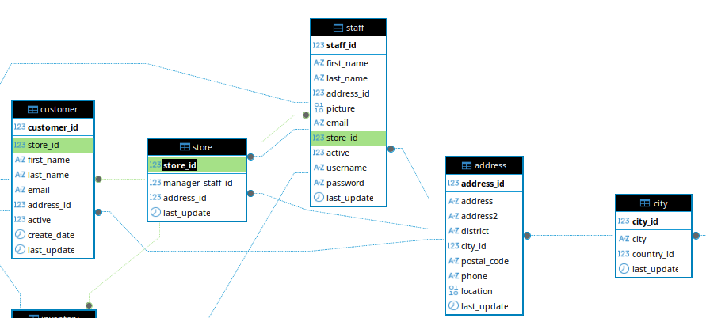
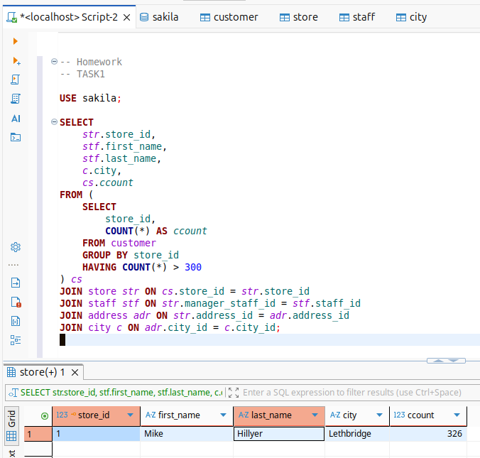
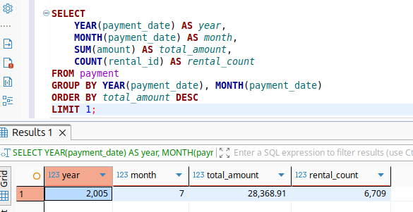

# Домашнее задание к занятию «SQL. Часть 2»

### Задание 1

Database - "Sakila".
Одним запросом получите информацию о магазине, в котором обслуживается более 300 покупателей, и выведите в результат следующую информацию: 
- фамилия и имя сотрудника из этого магазина;
- город нахождения магазина;
- количество пользователей, закреплённых в этом магазине.



```
USE sakila;

SELECT 
	str.store_id, 
	stf.first_name, 
	stf.last_name,
	c.city,
	cs.ccount
FROM (
	SELECT 
		store_id, 
		COUNT(*) AS ccount
	FROM customer 
	GROUP BY store_id 
	HAVING COUNT(*) > 300
) cs
JOIN store str ON cs.store_id = str.store_id 
JOIN staff stf ON str.manager_staff_id = stf.staff_id
JOIN address adr ON str.address_id = adr.address_id
JOIN city c ON adr.city_id = c.city_id;
```




### Задание 2

Получите количество фильмов, продолжительность которых больше средней продолжительности всех фильмов.
```
SELECT COUNT(*) FROM film 
WHERE `length` > (SELECT AVG(length) FROM film);
```


### Задание 3

Получите информацию, за какой месяц была получена наибольшая сумма платежей, и добавьте информацию по количеству аренд за этот месяц.

```
SELECT 
	YEAR(payment_date) AS year,
    MONTH(payment_date) AS month,
    SUM(amount) AS total_amount,
    COUNT(rental_id) AS rental_count
FROM payment
GROUP BY YEAR(payment_date), MONTH(payment_date)
ORDER BY total_amount DESC
LIMIT 1;
```


